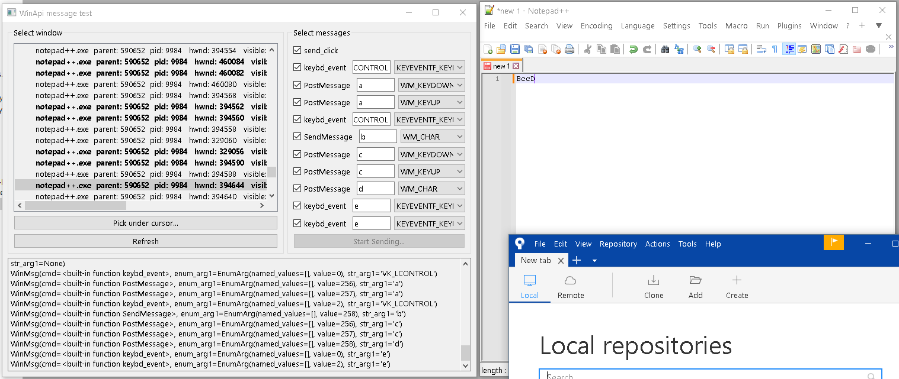

# Background WinApi messages
This tool main use is to prototype automation of different Windows programs with sequences of WinApi messages.  
Apparently, for most of the programs, **background** input is supported, but it can get tricky.  
For example, hotkeys like Ctrl+\* work inconsistently on background.

Tool includes list of processes and windows handles (including non-top ones) and easy pick of visible windows under cursor. 
Messages preset (SendMessage, PostMessage, keybd_event) mimic standard key and mouse input and can easily be extended. 

Made with Qt GUI, also uses threads just in case if they will be handy later. Based on my [py-qt-extensions](https://github.com/halt9k/py-qt-extensions) for PySide6 (QThread and QTimer and others).

Preview:

  

